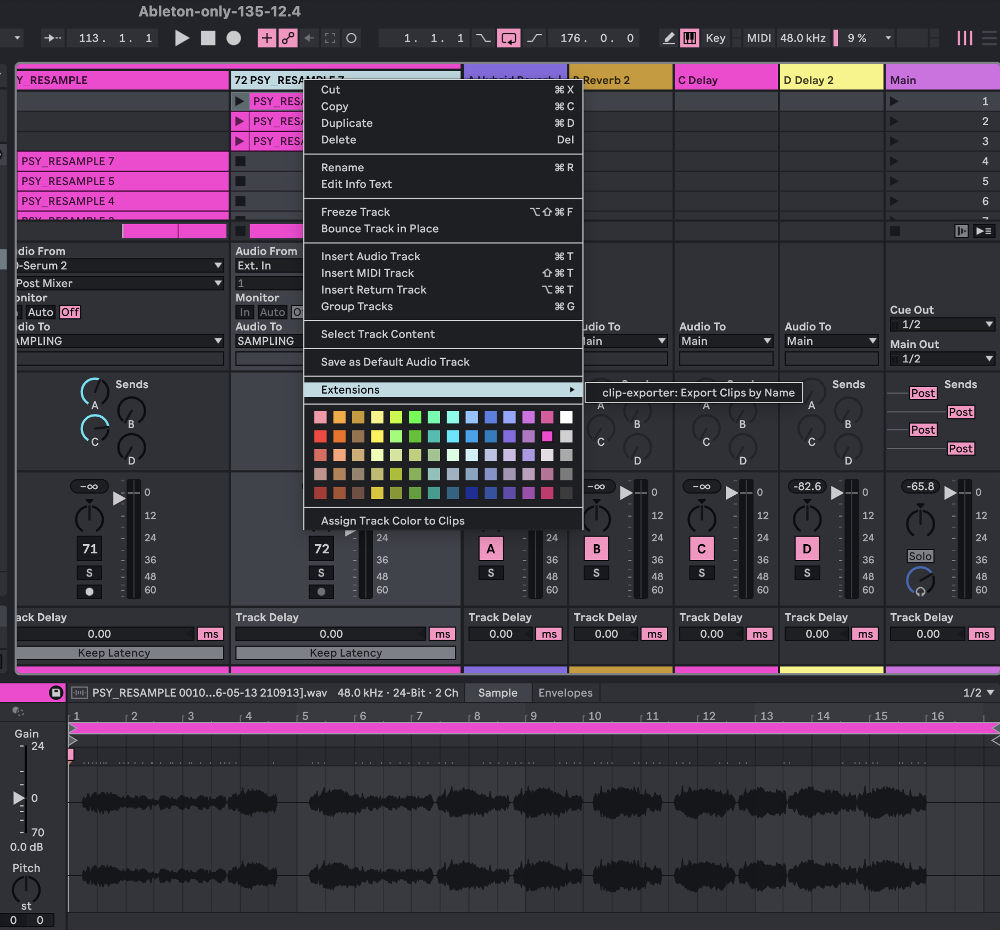
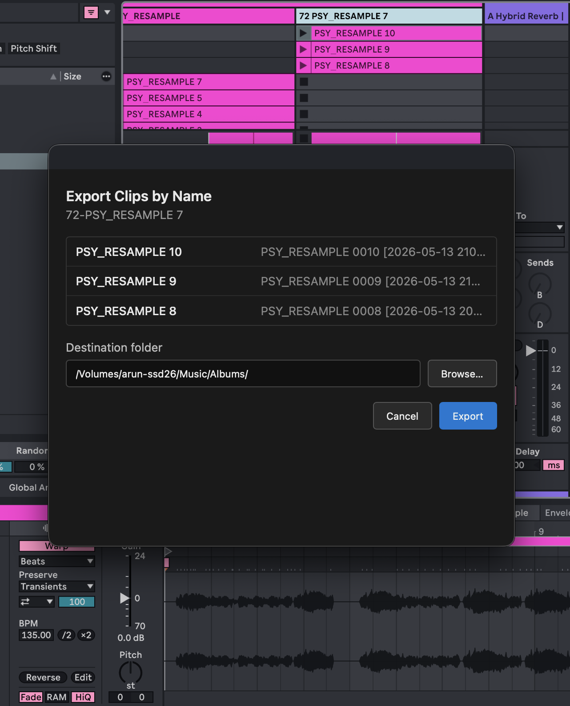

# clip-exporter

An Ableton Live extension that exports every audio clip on a track to a folder of your choice, using each clip's name as the file name.

Built with [`@ableton-extensions/sdk`](https://ableton.github.io/extensions-sdk/).

## Requirements

- Ableton Live 12 Suite Beta (12.4.5 or later) with Extensions support
- Node.js 24.14.1 or later
- **Developer Mode** enabled in Live: `Preferences → Extensions → Developer Mode`

## Setup

1. Install dependencies:

   ```sh
   npm install
   ```

2. Set the path to Live's Extension Host in `.env`:

   ```sh
   EXTENSION_HOST_PATH=/Applications/Ableton Live 12 Beta.app/Contents/Helpers/ExtensionHost/ExtensionHostNodeModule.node
   ```

   Adjust the path if your Live install lives somewhere else.

3. Open Ableton Live, then start the extension host:

   ```sh
   npm start
   ```

   Leave this terminal running. You should see `Extension activated` in the logs once Live connects.

## Usage

1. Open a Live set with an **audio track** that has session clips.
2. Right-click the audio track header.
3. Choose **Export Clips by Name** from the context menu.

   

4. Pick a destination folder in the export dialog, then click **Export**.

   

5. Clips are copied to the folder using their clip names. Duplicate names get a `(1)`, `(2)`, etc. suffix.


### Screenshots

Add PNG screenshots to `docs/screenshots/`:

| File | What to capture |
|------|-----------------|
| `context-menu.png` | Right-click menu on an audio track showing **Export Clips by Name** |
| `export-dialog.png` | The export dialog with folder path and clip list |
| `export-progress.png` | The progress dialog while clips are exporting |

## Scripts

```sh
npm start                  # build + run in Live's Extension Host
npm run build              # production bundle of src/extension.ts
npm run build:dev          # dev bundle (sourcemaps, not minified)
npm run package            # build for production + create a .ablx archive
```

## Get Started

Learn about building extensions: https://ableton.github.io/extensions-sdk/
